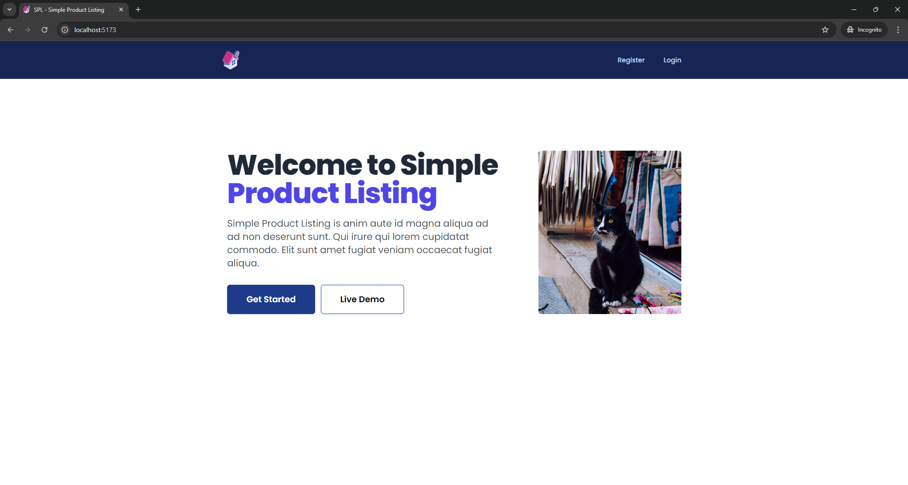
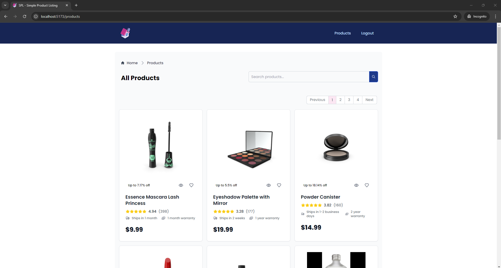

# Simple Product Listing

A Laravel 11 + React (TypeScript) application that provides a user-friendly interface using Tailwind CSS for managing products and external API integration.

### Tech Stack
    

## Key Features

- External API Integration
- Real-time Search
- Pagination
- Single Page Application (SPA)

## Prerequisites

- Composer
- Node/NPM
- PHP

## Installation

### Clone the Repository
```
git clone https://github.com/by-katorin/simple-product-listing.git
```

### Make Initial Setup

#### Backend
```
cd simple-product-listing/backend
cp .env.example .env

composer install
php artisan key:generate
```

#### Frontend
```
cd simple-product-listing/frontend
npm i
```

## Usage

### Start the Development server

#### Backend
```
php artisan serve
```
For the database, we can simply use SQLite. Create a blank _**database.sqlite**_ file inside backend/database/ folder.

In another Terminal tab/window, run migrations and seeders
```
php artisan migrate:fresh --seed
```

#### Frontend
```
npm run dev
```

### Access the Application

Visit http://localhost:5173 (or copy the Local server in `npm run dev` ) in your web browser.




#### Login Credentials

> <br>User: test@example.com <br> Password: password<br><br>

## Contributing

Contributions are welcome! Please follow these guidelines:

- Fork the Repository: Fork the project on GitHub.
- Create a Branch: Create a new branch for your feature or bug fix.
- Make Changes: Implement your changes and write tests.
- Submit a Pull Request: Submit a pull request to the main branch.

## Additional Notes

- For more information on the tech stacks used, please refer to their official documentation.
- Customize the project to fit your specific needs by adding more features or modifying the existing ones.
